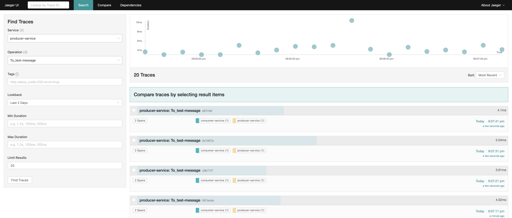
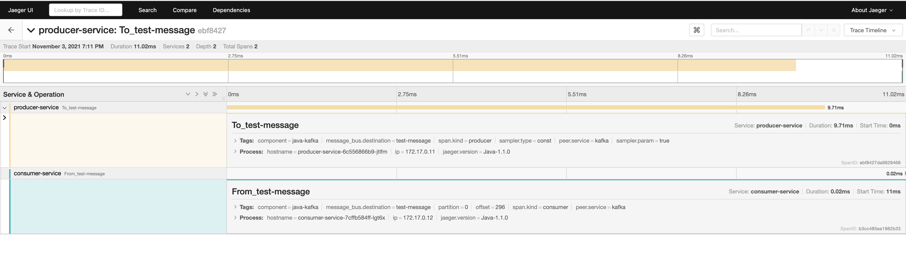

# test-kafka-jaeger


## Integrate Kafka-SpringBoot with Jaeger

- 스프링 프로젝트 dependency 추가

  ```xml
  <dependency>
  	<groupId>io.opentracing.contrib</groupId>
  	<artifactId>opentracing-spring-jaeger-cloud-starter</artifactId>
  	<version>3.1.2</version>
  </dependency>
  ```

- 스프링 프로젝트 외부설정 추가

  ```properties
  # application.properties
  spring.application.name=${Jaeger에서 쓰일 서비스 명 } 
  opentracing.jaeger.udp-sender.host=${Jaeger-agent 주소}
  opentracing.jaeger.udp-sender.port=6831
  opentracing.jaeger.log-spans=true
  ```


## Test Env / Prerequisite

- minikube
- metalLB

1. Clone the project

```bash
$ git clone git@github.com:tmax-cloud/test-kafka-jaeger.git
$ cd test-kafka-jaeger
```

2. Deploy jaeger & kafka

```bash
$ kubectl apply -f k8s/jaeger/.
$ kubectl apply -f k8s/kafka/.
```

3. Set environment variables

```bash
$ export SERVICE_NAME=<서비스명>
$ export JAEGER_AGENT_HOST_ADDR=<Jaeger-agent IP주소>
$ sed -i 's/{SERVICE_NAME}/'${SERVICE_NAME}'/g' k8s/springboot-kafka/cosnumer-deployment.yaml
$ sed -i 's/{SERVICE_NAME}/'${SERVICE_NAME}'/g' k8s/springboot-kafka/producer-deployment.yaml
$ sed -i 's/{JAEGER_AGENT_HOST_ADDR}/'${JAEGER_AGENT_HOST_ADDR}'/g' k8s/springboot-kafka/cosnumer-deployment.yaml
$ sed -i 's/{JAEGER_AGENT_HOST_ADDR}/'${JAEGER_AGENT_HOST_ADDR}'/g' k8s/springboot-kafka/producer-deployment.yaml
```

4. Deploy services

```
$kubectl apply -f k8s/springboot-kafka/.
```

5. Confirm that services are registered on Jaeger
   - get jaeger-agent ip

```
kubectl get svc jaeger-query -o jsonpath='{.status.loadBalancer.ingress[].ip}'
```

Jaeger 스크린샷 




